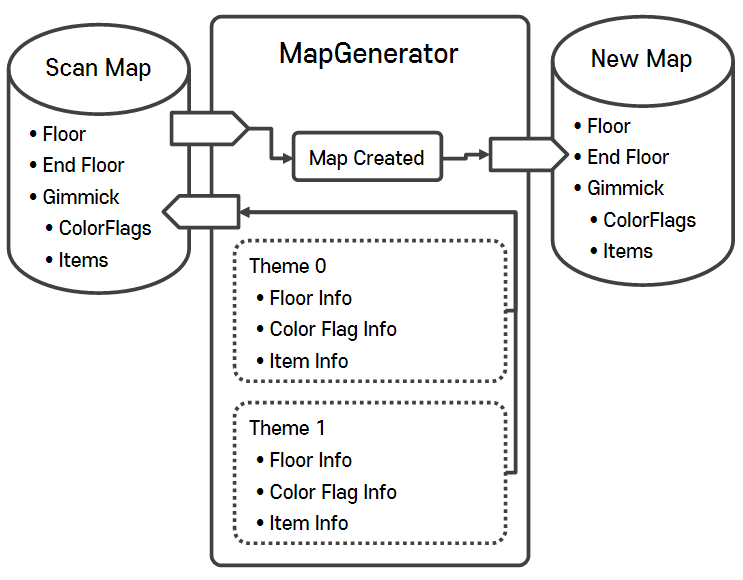

# AutoMapGenerator

#### ⦁ [AutoMapGenerator]는 **[Stacking Color Match](https://play.google.com/store/apps/details?id=io.supercent.stackingcolormatch)** 의 작업 내역 중, 맵 자동 생성 시스템을 재구성한 시스템입니다.

#### ⦁ Version 1.0 (2023.09.05)

### 1. 데모 이미지

    

### 2. 개발 의도

- [라이브] 단계에 들어감에 따라 기존에 있던 레벨(또는 스테이지)의 양이 늘어 **레벨 제작을 자동화하는 것을 목표**로 하였음.

- 자동화할 수 있었던 가장 큰 이유는 **'반복되는 맵 구조', '테마에 한정된 아이템', '등장하는 색상의 제한'** 등이며 시스템 설계에 가장 중요한 부분이 되었음.

### 3. 조건

- **'설계도'가 되는 'Scan Map'** / 맵안에 배치되는 **'아이템', '색상 깃발', '바닥'** 등이 서로 따로 **객체화** 되어있어야 함.

- **'설계도'만 존재하면, 다양한 테마를 구성**할 수 있어야함.

### 4. 메인 설계
 

    

- **Scan Map**

  - 'Scan Map'은 새로운 맵을 위한 설계도 (테마, 오브젝트 배치) / Object인 객체
 
  - **[Scan Map](https://github.com/MinjunISAAC/AutoMapGenerator/blob/main/AutoMapGenerator/Assets/Game/Scripts/Map/ScanMap.cs)**
 
- **Map Generator**

  - 'Theme Type'에 맞는 '바닥', '색상 깃발', '아이템'들을 가지고 있음. / Object인 객체
 
  - 'Scan Map'을 기반으로 'Theme Type'에 맞도록 새로운 맵 생성
 
  - **[Map Generator](https://github.com/MinjunISAAC/AutoMapGenerator/blob/main/AutoMapGenerator/Assets/Game/Scripts/Map/MapGenerator.cs)**
  
### 5. 피드백

- 맵 구성에 필요한 객체들을 모두 Class로 생성하게 되었는데, 몇몇 부분은 **ScriptableObject로 구성하여, 모듈화** 시키는게 **관리 측면에서 좋다는 생각**.
 
